 

### Akira

Second-year CS student at Manchester Metropolitan University.
Building across Java, Python, C#, and JavaScript — 3x Microsoft Azure certified.

Currently working as a **part-time assistant** and contributing to the **MMU Minecraft Society** bot as a group project.

 

 

### Projects

#### [SecureVault](https://github.com/ekql-ops/securevault)

A command-line password manager built in Python with AES-256 encryption, PBKDF2 key
derivation, and a built-in secure password generator. All data is stored locally —
nothing ever leaves your machine.

`Python` · `Cryptography` · `AES-256` · `PBKDF2`

#### [GradeTracker](https://github.com/ekql-ops/grade-tracker)

A Java CLI application for managing student records and grades. Features a clean
layered architecture, SQLite database, UK degree classification, per-student reports,
and CSV export.

`Java` · `SQLite` · `JDBC` · `OOP`

#### [Azure Sentiment Analyser](https://github.com/ekql-ops/azure-sentiment)

A Python tool that integrates with Microsoft Azure Cognitive Services to perform
real-time sentiment analysis, key phrase extraction, opinion mining, and language
detection on any text.

`Python` · `Azure AI` · `Text Analytics` · `NLP`

#### [WorkTrack](https://github.com/ekql-ops/worktrack)

A React-based employee clock-in/out app, born out of using a buggy shift app at work
and wondering if I could build something smoother. Features a tap-to-clock-in shift
list, a live countdown ring, late-shift alerts, and a full admin panel for managing
sessions.

`React` · `JavaScript` · `CSS`

#### [DBD Bot](https://github.com/ekql-ops/DBD-Bot)

A full-featured Discord bot built for a Dead by Daylight community. Includes a custom
perk and killer database with live tier info, moderation tools, XP leveling, ticket
system, and verification.

`Node.js` · `Discord API`

#### [MMU Minecraft Society Bot](https://github.com/impossibleiman/Discord-Bot-Group-Project)

A full-featured Discord bot built as a university group project. Handles server
verification, invite tracking, reaction roles, event management, a ticket system, and
an AI chat bot — deployed for a live student community.

`Java` · `JDA` · `Discord API` · `REST API`

### Tech Stack

### Certifications

- Microsoft Certified: Azure Fundamentals — AZ-900
- Microsoft Certified: Azure AI Fundamentals — AI-900
- Microsoft Certified: Power BI Data Analyst Associate — PL-300

### Education

**BSc Computer Science** — Manchester Metropolitan University *(2024–2027)*

1st Class — Algorithms & Data Structures · Databases · Graduate Skills · Mathematics · Programming · Team Project · Web Development  
2:1 — Computer Architecture · Computer Networks

**HND Applied Science** — Holy Cross Sixth Form College *(2023)*  
A* — Applied Science · Laboratory Skills & Research

### Stats

`bakri20041@outlook.com` · Manchester, UK · Open to placements and part-time roles

